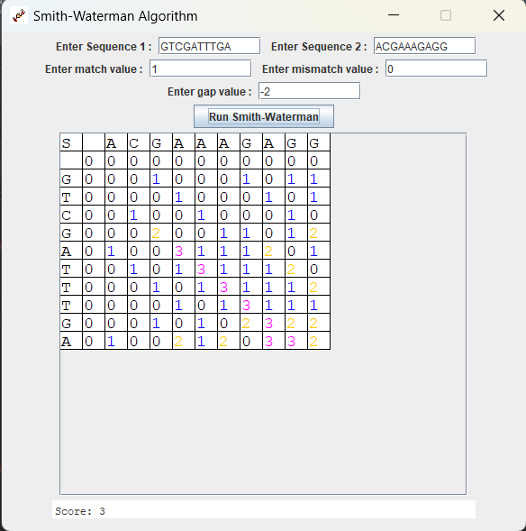

# Assignment 1 : Smith-Waterman
### Discipline : Java

Algorithm that compares 2 DNA sequences by applying the Smith-Waterman algorithm

\

# Authors

#### EFREI L3 - S5 - Promo 2026

[Mathis GITON](https://github.com/MathisG179)\
[Axel LOONES](https://github.com/AxelLns)\
[Thibaut MENIN](https://github.com/Pulsar94)\
[Marc ROUGAGNOU](https://github.com/MarcEfrei)

# Use

Run the `main` function in `Main.java` to start the program in the terminal.\
Run the `main` function in `GUI.java` to start the program with the Graphic User Interface.